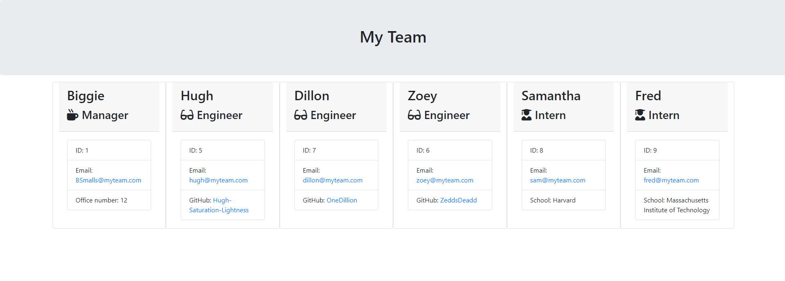

# team-profile-generator

## Description

This is a command-line program written in Node.js. This program is designed to generate a Team Profile page in HTML format based on the user's input.

The user is prompted to add team members and their details via the command-line using the Inquirer module.

User's can add Managers, Engineers, and Interns to the team and a seperate card will be generated for that team member - populated with the team member's information, as entered by the user.

Below is an image displaying the web page that is generated once upon following the command-line prompts.

Several Jest tests have been pre-written for the program and I have ensured that my code passes these tests. Below is a screenshot showing that all tests pass.

